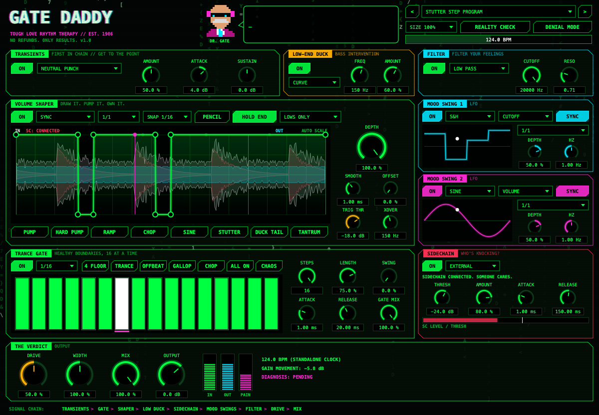

# GATE DADDY

**Tough love rhythm therapy. Est. 1986.**

A sidechain / trance gate / volume shaper plugin for electronic music, hosted by Dr. Gate, an 80s EDM producer with opinions about your low end.

AU · VST3 · Standalone. Built with [JUCE](https://juce.com).



## Install

Grab the latest build from **[Releases](https://github.com/neomoney333/gate-daddy/releases/latest)**.

**Mac:** download `GateDaddy-x.y.z-mac.pkg` and run it. It installs the AU, the VST3 and the standalone app.
The installer isn't signed yet, so macOS will block it the first time: open **System Settings → Privacy & Security**, scroll down, and click **Open Anyway**.

**Windows:** unzip `GateDaddy-x.y.z-windows.zip` and copy `Gate Daddy.vst3` into `C:\Program Files\Common Files\VST3`.

**In Ableton:** Settings → Plug-ins → enable VST3 / Audio Units → **Rescan**. Gate Daddy shows up under *Gate Daddy Labs*.

**Updates:** Gate Daddy checks for new releases when you open it. If one exists, an **UPDATE** button appears next to the logo. Click it, run the installer, restart Ableton.

## What it does

Signal chain: **TRANSIENTS → GATE → SHAPER → LOW DUCK → SIDECHAIN → MOOD SWINGS → FILTER → DRIVE → MIX**

| Module | What it does |
|---|---|
| **Transients** | Attack/sustain shaper that runs first. Four listening profiles. |
| **Trance Gate** | 16-step gate, 1/4 to 1/64 including triplets and dotted notes. Swing, step length, attack/release, per-step level. |
| **Volume Shaper** | Draw your own volume curve (ShaperBox-style). Sync, free Hz, **input trigger** or **sidechain trigger** (restarts on every kick), hold end, snap, pencil. Can shape only lows or only highs. |
| **Low-End Duck** | Ducks just the bass under a frequency, following the curve or the sidechain. |
| **Sidechain** | Classic kick ducking from Ableton's sidechain input (or the track itself). |
| **Mood Swings 1 & 2** | LFOs (sine, triangle, saws, square, S&H, drift, or your drawn curve) → cutoff, resonance, pan, volume, drive or width. |
| **Filter / Verdict** | Low/high/band-pass filter, drive, stereo width, dry/wet, output, meters, and a Pain Meter. |

Extra buttons: **REALITY CHECK** randomizes the rhythm. **DENIAL MODE** bypasses everything.

### Sidechain in Ableton
Open the little triangle in Gate Daddy's device title bar → **Sidechain** → pick your kick track. The panel will say *"SIDECHAIN CONNECTED. SOMEONE CARES."*

## Build from source

Needs CMake 3.22+ and a C++20 compiler (Xcode Command Line Tools on Mac, Visual Studio 2022 on Windows). JUCE downloads automatically.

```bash
cmake -B build -DCMAKE_BUILD_TYPE=Release
cmake --build build --config Release -j8
./build/GateDaddyTest_artefacts/Release/GateDaddyTest   # audio + state tests
```

On Mac the build copies the plugins straight into `~/Library/Audio/Plug-Ins`. Restart Ableton (or rescan) to pick up changes.

## Shipping an update

```bash
./scripts/release.sh 1.0.1
```

This bumps the version, tags it, and pushes. GitHub Actions builds and tests the Mac and Windows versions and publishes a Release. Everyone running an older Gate Daddy sees the UPDATE button the next time they open it.
